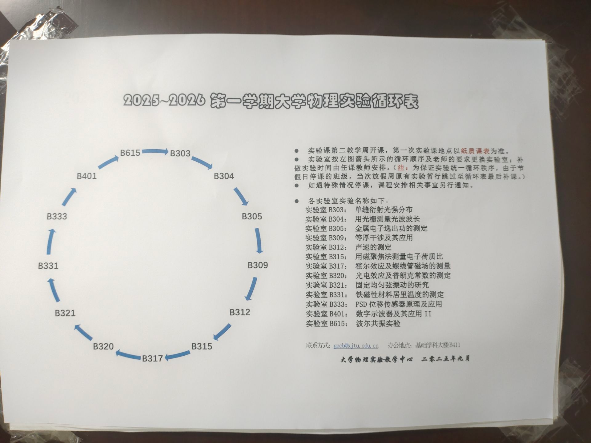

## 大学物理实验数据处理
**HZY最初开始开发这个项目时候过于理想
所以现在这个项目存在一些问题，最后大多数实验还是选择使用Excel+IO进行开发**
>本实验缺乏一些实验报告参考。如果大家觉得自己从这个项目受益或者想要奉献自己，请联系作者1754203003@qq.com

>很高兴给本项目能给大家带来便利,如果项目有任何错误的地方，可以在github使用issue提出，也可以直接通过邮箱联系作者。
#### 优势
* 直接使用Excel辅助制作表格，更直观便捷
* OI数据读取更方便
* 可以使用matplotlib进行画图并输出
* 模板性强，便于多人协助开发
#### 注意事项
* 本文在一些实验中的IO输出并不是完美答案，希望大家可以多提意见，我会精益求精的
* 每个小实验里面都有很多文件夹和说明文件:data,pyc,raw,results,main.py,README.md
    * data: 里面需要放入你的实验数据，直接打开里面的文件填表
    * main.py : 代码启动位置，请注意控制台输出，会有你的实验结论
    * result(s) : 里面存放所有表格和输出图像。你的源表格可能有一些行或者列需要计算，这里会自动计算 ，所以**这里面的每一个文件都是有用的**
    * pyc:实验源代码的存储位置
    * raw：数据表格空模板
#### 不足与缺陷
* B303 : 
* B304 : 开发有前端计算工程。直接使用html
* B305 : 只开发了稀碎的小函数，属于半成品
* B309 : 
* B312 : 
* B315 : 
* B317 : 较完善的一个实验
* B320 : 较完善的一个实验。
* B321 : 只有注意事项，因为这个实验课堂上直接交了（后期作者会把实验结果和数据补上去）
* B331 :
* B333 : 
* B401 : 
* B615 : 
 

#### 使用方法
在data文件夹下，有本次实验你需要自己测数据的表格，你只需要打开这些表格
然后把自己的数据填上去就好了。

然后进入main.py进行启动，在results中有所有你想要的东西

请记住，results中所有的东西都是有用的。不要忘记写！！！

还有，请注意程序的输出，有你的实验需要写的东西。

本项目会尽量做到完美无缺，但由于作者只有一个人，所以受主观影响很严重

请读者自行斟酌
#### 大物排课表
